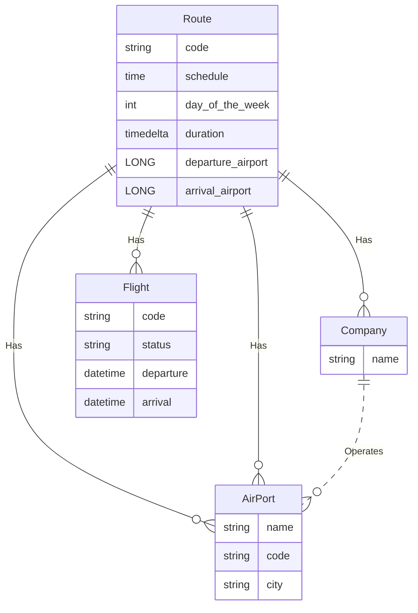

```mermaid
erDiagram
    AirPort {
      string name
      string code
      string city
    }
    Company{
      string name
    }
		Route {
       string code
       time schedule
       int day_of_the_week
       timedelta duration
       LONG departure_airport
       LONG arrival_airport
    }
		Flight {
       string code
       string status
       datetime departure
       datetime arrival
    }


    Route ||--o{ Flight : Has
    Route ||--o{ AirPort : Has
    Route ||--o{ AirPort : Has
    Route ||--o{ Company : Has
    Company ||..o{ AirPort : Operates
```
